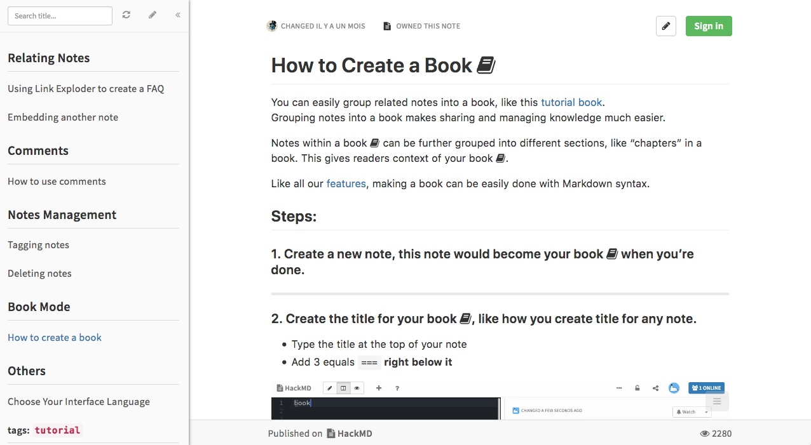

Le service d'édition et de collaboration en ligne [HackMD](https://hackmd.io/) propose de «créer un livre» ([_How to Create a Book_](https://hackmd.io/c/tutorials/%2Fs%2Fhow-to-create-book)) avec un ensemble de notes en Markdown.

>You can easily group related notes into a book, like this tutorial book.  
>Grouping notes into a book makes sharing and managing knowledge much easier.
>
>Notes within a book can be further grouped into different sections, like “chapters” in a book. This gives readers context of your book .

Chaque page est en fait une «note». La première page («note») fait office de couverture et de table des matières.

Une forme plutôt simple du livre, qui ressemble davantage à un wiki qu'à un ouvrage littéraire…

On remarquera l'interface à panneau sur le côté gauche, similaire à la publication de Getty Pubs.

## Autres réflexions

Possibilité d'exporter dans un format portatif? C'est du markdown, le code source de chaque fichier est disponible. Mais le service propose dse fonctionnalités supplémentaires intégrées au Markdown; utiliser ces fonctionnalités extra-langage brise le standard, et fait moins de portabilité…
