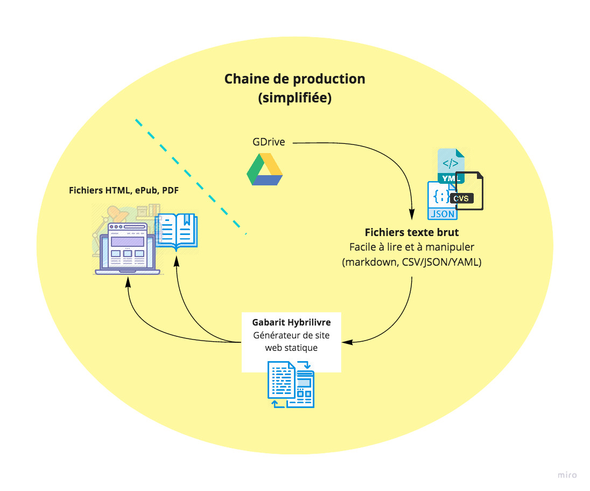

[TOC]

## Introduction : contexte du projet et de la publication numérique

Le projet est né du colloque [ÉCRiDiL](http://ecridil.ex-situ.info/) à Montréal les 30 avril et 1er mai 2018. L’objectif était de rassembler des connaissances qui y ont été présentées afin d’en produire un **acte de colloque innovant**, en ligne avec le sujet des conférences (« Le livre, défi de design : l’intersection de la création et de l’édition »).

>Le colloque ECRiDiL étudie sans les séparer les trois usages fondamentaux de la chaîne du livre (ÉCRire, éDIter,  Lire) à partir de la culture de l’innovation par le design, dans  l’esprit de l’innovation sociale et numérique.

Pour cette publication, on ne souhaitait pas simplement faire un acte de colloque traditionnel (comme [celui découlant de l’édition 2016 à Nîmes](https://desinnolivre.tumblr.com/)), dont le format peu attrayant et conçu selon les techniques plutôt « fermées » de l’imprimé ne serait absolument pas en phase avec le caractère innovant des idées présentées lors de l’événement; plutôt, l’ambition était de produire un ouvrage **ouvert**, intégrant une multitude de **contenus multimédias**, tout en conservant son caractère **scientifique** et en ayant un aspect **visuellement intéressant**. L’ouvrage devrait donc s’inscrire nativement dans les nouvelles **pratiques numériques**, mais sans délaisser l’**imprimé** – une version papier doit nous attendre au bout de la chaîne éditoriale. Bref, un autre de défi de design.

Comment produire une publication innovante tout en préservant l’héritage du codex, dont le paradigme traditionnel de la page est encore bien présent dans notre conception du « livre »? Le cadre technique de la « page » a-t-elle toujours sa place? Quel équilibre conserver entre linéarité textuelle et tabularité des contenus? Comment fabriquer un livre sans passer par un processus d’édition long et pénible?

## Défi : créer une publication hybride innovante

L’idée, que j’emprunte à Antoine Fauchié, c’est de concevoir une [chaîne de publication inspirée du web](https://www.quaternum.net/2017/03/13/une-chaine-de-publication-inspiree-du-web/). Concevoir une publication avec les outils du web pour une édition ouverte, multiformat, collaborative et suffisamment robuste pour être à l’épreuve du future.

### Les problèmes des chaînes de publications existantes

Les auteurs écrivent très souvent dans un logiciel de traitement de texte comme Microsoft Word. Il en résulte généralement peu ou pas structuré sémantiquement. Un important travail de **mise en forme** est à faire lors de l’étape de l’édition : le manuscrit est **complètement retranscrit** dans un le format utilisé par la maison d’édition (par exemple, avec le logiciel propriétaire InDesign d’Adobe). À ce moment, le texte existe déjà en deux copies indépendantes : le manuscrit original et la version mise en forme. Cela signifie que toute modification faite par l’auteur (ponctuelle ou étendue) doit à nouveau repasser par un geste de mise en forme manuelle par les éditeurs, ce qui consomme à chaque fois temps et argent[^1].

Ce problème a un nom : c’est celui du **couplage entre traitement de texte et <abbr title="Publication assistée par ordinateur">PAO</abbr>**. Les auteurs et les éditeurs utilisent très souvent les logiciels Microsoft Word et Adobe InDesign respectivement, des logiciels qui leur permettent de penser graphiquement leur texte en éclipsant la question sémantique. Les auteurs sont habitués à écrire dans un logiciel de traitement de traitement de texte qui leur donne un aperçu graphique, mais non sémantique. Le logiciel InDesign permet un contrôle avancé sur la mise en page et la conception graphique, mais c’est une voie à sens unique vers un format de publication fixe dépourvu de structuration sémantique du contenu.

Peut-on imaginer un système permettant de passer aisément du manuscrit au produit fini, sans avoir besoin d’intervenir manuellement sur l’édition du texte? Pour emprunter un paradigme au monde du logiciel, y a-t-il une façon d’automatiser un cycle de développement?

### Problème d'accord fond-forme : le format numérique, tendon d’achille des publications savantes

## Quelles solutions existent déjà?

### Comment résolvent-elles les problèmes de la publication numérique?

### Qu'est-ce qu'il reste à faire?

## La solution (aboutissement de cette ronde de recherche)

Une bonne partie de la réponse se trouve dans le [billet](https://www.quaternum.net/2017/03/13/une-chaine-de-publication-inspiree-du-web/) d'Antoine Fauchié : _Une chaîne de production inspirée du web_.

L'idée, c'est d'employer des **technologies ouvertes** (libres, transparentes et accessibles à tous) qui permettent la **collaboration** et le **versionnement**, qui permettent la **production multisortie** (c’est-à-dire en plusieurs **formats**) pour une « partageabilité » facilitée dans les canaux de diffusion contemporains (web et imprimé).

### Écrire

Idéalement, le texte devrait être produit dans un format ouvert et balisé, mais complètement découplé de tout formatage visuel. Le **Markdown** constitue un excellent exemple : il est léger, standard et très répandu, offrant une syntaxe légère pour baliser les éléments d’écriture de base (niveaux en-têtes, emphase, citations, listes, etc.).

Le hic, c'est que les auteurs sont déjà très confortables dans leurs logiciels de traitement de texte, comme **Microsoft Word**, lequel n’est pas très interopérable et produit du texte généralement peu structuré. Des outils comme [Pandoc](https://github.com/jgm/pandoc) permettent aisément de passer du format `.docx` au format `Markdown`, mais l’édition dans Word introduit souvent beaucoup d’éléments superflus dont qu’il faut nettoyer à la main.

Une solution? Une édition « propre » dans Google Drive

### Collaborer, valider, versionner

Le versionnement peut se faire avec Git, qui permet essentiellement de versionner du **texte**. Le code, c'est du texte; du texte, c'est… du texte. Alors pourquoi pas utiliser cet outil extrêmement puissant, qui permet des révisions décentralisées et de conserver tout l'historique de travail?

> Plutôt que de travailler sur une même plateforme fermée et limitée, ou plutôt que d’échanger des fichiers avec des numéros de version rapidement incompréhensibles, un fonctionnement plus logique est de _versionner_ […]
>
> Antoine Fauchié

Encore une fois, rares sont les auteurs avec les aptitudes techniques pour travailler directement dans le système Git. Des solutions en ligne comme [Forestry](https://forestry.io/) (« Votre équipe toute entière sera en train de faire des *commits* » peut-on lire sur leur page d'accueil).

### Mettre en forme

La mise en forme d'un document **HTML** avec **CSS** est la base d'une édition systématique, moderne et interopérable.

Le langage CSS est celui qui donne forme et couleur au web : c'est tout simplement un ensemble de propriétés qu'on déclare (ex. `color: orange`) sur des classes d'éléments (ex. `article`, `header`, `footer`, soit divers éléments qui constituent la page). Pas de programmation, que de simples déclarations.

### Fabriquer

Travailler avec les technologies web ne signifie pas qu'il faut se restreindre à ce format, au contraire! Comme c'est un langage ouvert et structuré, il est possible de passer facilement d'un format à l'autre grâce au **balisage** qui structure le texte (en-têtes, légendes, sections, etc.) en parties **sémantiques** et en y intégrant des **métadonnées** (lisibles par des machines, ce qui permet notamment l’indexation). Des logiciels comme Panodc ou [PrinceXML](https://www.princexml.com/) permettent par exemple de générer des PDF.

### Publier

L'idée d'utiliser le **langage du web pour publier**, c'est parce que c'est un format **standard**, très répandu et qui va de pair avec l'**URL** _(Universal Resource Locator)_ : n'importe qui peut accéder au contenu via le [lien](https://www.theguardian.com/technology/2019/mar/12/tim-berners-lee-on-30-years-of-the-web-if-we-dream-a-little-we-can-get-the-web-we-want).

> The crucial thing is the URL. The crucial thing is that you can link to anything.
>
> Tim Berners-Lee

Ce sur quoi insiste tant Tim Berners-Lee, l’inventeur du web, c’est le caractère foncièrement publique de l’URL. Avec l'URL, les contenus ne sont (_a priori_) pas enfermés dans un lieu physique ou dans une application propriétaire, par exemple. L'URL doit nécessairement pointer vers une référence publique. comme composante fondamentale du web. 

Quiconque avec un téléphone portable, un ordinateur de bureau, une montre inteligente, une télévision connectée ou même un frigo peut accéder au web via l’URL.

### L'adaptation d'une solution existante : Getty Publications 

Le mantra :

> Create once, publish everywhere
>
> [Getty Pubs](http://blogs.getty.edu/iris/an-editors-view-of-digital-publishing/)

L'idée est donc de créer un gabarit, un moule dans lequel entre du **texte** et quelques données structurées (juste du texte, encore une fois, légèrement balisé et très lisible).

## La suite : un gabarit recyclable

Dans une solution comme celle-ci, **le contenu et l'architecture sont découplés**, ce qui permet, en théorie, de changer de forme en conservant le même contenu de départ (pourvu que celui-ci soit dans un format ouvert et standard, comme une brochette markdown/YAML).

[^1]: **Constat** : plusieurs recettes éditoriales existent, propres à chaque maison d’édition qui les gardent jalousement pour elles. Pour quelles raisons? Probablement dans un esprit de compétition relevant du secret industriel – ou alors, elles le font pour ne pas exposer le processus douloureux, mal structuré et compliqué de leurs méthodes internes. Ce qui est dommage et inefficient, c’est qu’on réinvente la roue à chaque fois. Tant de solutions avec un objectif commun : faire des livres.

